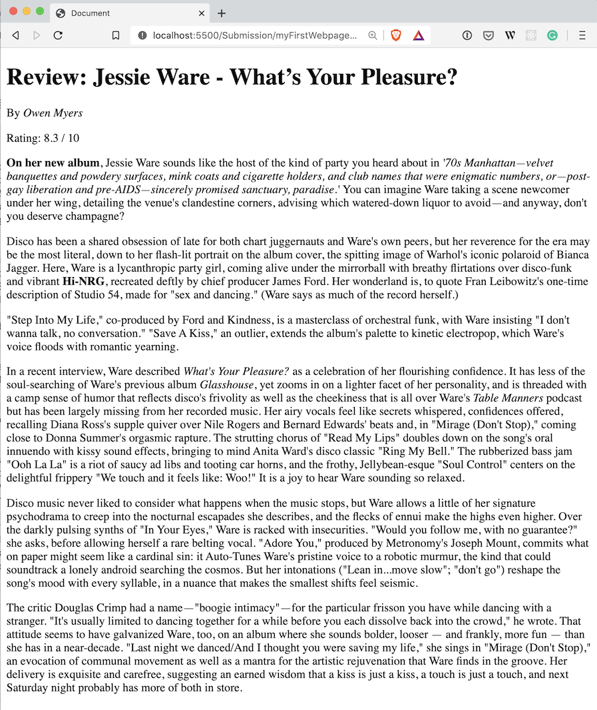

# 01 Challenge - My first website

Create your first website using HTML

**Contents**
- [01 Challenge - My first website](#01-challenge---my-first-website)
  - [Learning Outcomes](#learning-outcomes)
  - [Challenge Brief](#challenge-brief)
  - [Rationale](#rationale)
  - [Getting Started](#getting-started)
  - [Challenge Instructions](#challenge-instructions)
  - [Challenge recap](#challenge-recap)
- [Submit the Challenge](#submit-the-challenge)
- [Git CLI Refresher](#git-cli-refresher)

---

## Learning Outcomes

* LO6 - Use software development standards to implement a user interface.

---

## Challenge Brief

Take the [Google Document](https://docs.google.com/document/d/1cYypYAKGYEA6Ar4XfUU_TYGYGpAvzHdL5OMw0MJtJzM/edit?usp=sharing), and convert the text to semantic HTML, so it can be displayed on a website.

When you have completed the challenge, you should have a website that looks like this:



---

## Rationale

HTML is the foundation of the internet, and web developers need to have an understanding of how to write HTML. 

Web developers need to know what HTML tags mean, so they can represent their content correctly when marking up their text in HTML.

Search engines and other tools can read HTML, and derive meaning from the HTML to display search results. 

---

## Getting Started

1. Accept the challenge with the challenge link from the class notes.
2. `clone` to your local computer using VS Code or the Terminal.
3. Read the challenge instructions and get started.
4. The code for this challenge should go into `/Submission/static/js/script.js`.

## Challenge Instructions

This challenge involves converting an album review from a Google Document into meaningful HTML. You should have your HTML reference ready, so you know what HTML elements to use when writing your HTML.

1. Open the [Google Document](https://docs.google.com/document/d/1cYypYAKGYEA6Ar4XfUU_TYGYGpAvzHdL5OMw0MJtJzM/edit?usp=sharing) to view the text you will be converting to HTML
2. Investigate the document, and identify the different styles of text that exist. You can see a heading, paragraphs, bold, and emphasised text. What HTML elements represent these?

    

3. Now you have an idea of the content you will be converting to HTML. Let's start by creating an HTML file. 
4. In the `Submission` folder, create a new file, `myFirstWebpage.html`. You can do this in VS Code, by opening File Explorer, and right-clicking on the `Submission` folder, then choosing `New File`

    

5. Open `myFirstWebpage.html` by double-clicking it. You should have an empty file. 
6. It's time to start writing your HTML page. Using [Anatomy of an HTML document](https://developer.mozilla.org/en-US/docs/Learn/Getting_started_with_the_web/HTML_basics#Anatomy_of_an_HTML_document) as a reference, create the outline of your HTML document. Your HTML should look the same as the example provided, and have an `html`, `head`, and `body` tag. Don't forget to close your tags. Every tag should be written once with no slash, and then once with a slash. This is commonly referred to as opening and closing tags. For example: `<body></body>`
7. You should now have the basics of an HTML page. Let's test if it works, by right-clicking on your page in the VS Code Explorer, and clicking `Open with Live Server`. This should pop open your browser, and will either show nothing, or a broken image if you copied and pasted the example.

    

8. It's time to convert the Google Document to HTML. We want to nest our HTML inside the `body` tag, as this is the part of the HTML page the browser displays to the user. In the HTML file in VS Code, move your cursor so it is inside the `<body>` tag. That means it should be after the opening tag `<body>` and before the closing tag `</body>`

    

9. Now it's time to write your HTML. Copy and paste the text from the Google Document into your HTML file. Then markup your text using HTML, using appropriate HTML tags to match the content type of the text. 
10. You should reference today's material on [W3Schools](https://www.w3schools.com/tags/default.asp) and [MDN](https://developer.mozilla.org/en-US/docs/Web/HTML/Element) to figure out what HTML tags you need.
11. Some tips to remember when writing HTML:
    * Don't forget to close your HTML tags. For example, if you are using the `em` tag, it needs to be open and closed: `<em>My text will be emphasised</em>`
    * You can nest some elements inside other elements, for example, you can put an emphasis tag inside a paragraph tag: `<p>My paragraph with <em>emphasis</em></p>`
    * Emmet might save you some time, check out this [Stack Overflow post](https://stackoverflow.com/a/46854557), and look at the accepted answer with the green tick to learn some shortcuts when writing HTML.
12. Once you have finished, open your website in your browser using Live Server. Check if it looks ok, and then submit your challenge.

## Challenge recap

1. You structured an HTML document, with the `html`, `head` and `body` tags.
2. You marked up text with HTML tags, to describe the type of text in the document. 

---

# Submit the Challenge

- [ ] Answer the questions in the [Feedback](feedback.md) file, and commit
- [ ] Commits are pushed to GitHub

Submissions for this challenge are tracked through GitHub classroom. When you `push` code to the repo it will run any tests on your submitted code and give you a result.

You can check the Autograder logs and results in the challenge repo, under the `Actions` tab.

Your challenge repos can be found here: https://github.com/developers-institute-wdd01

---

# Git CLI Refresher

```shell
# example git clone command - replace this URL with your repo's URL
git clone git@github.com:Developers-Institute-WDD01/01-challenge-CHALLENGE-NAME--YOUR_NAME.git

# make sure to change directory into the cloned directory
cd <01-challenge-CHALLENGE-NAME--YOUR_NAME>

# open VS Code
code .

# start coding ...

# when ready to commit and push
git add .

git commit -m "My client-side challenge"

git push origin master
```
